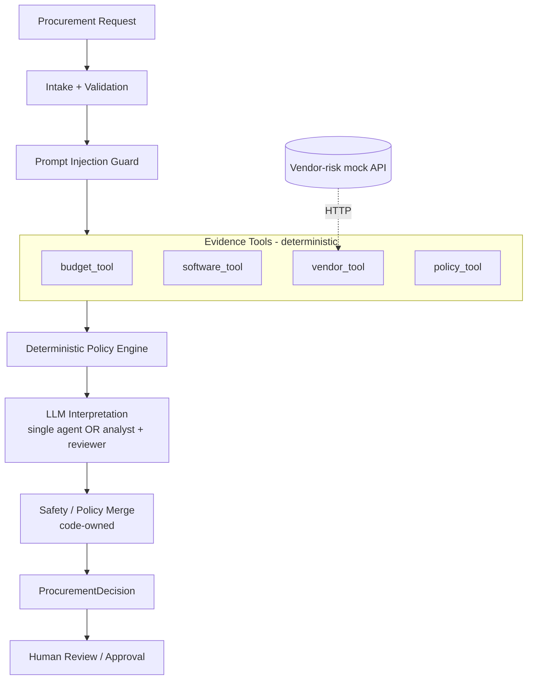
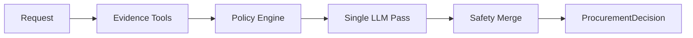
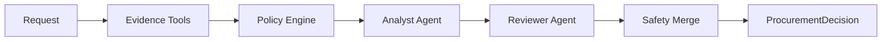

# AI Procurement Request Copilot — FDE Assessment 3

An evidence-first internal procurement copilot for software/SaaS requests.


The system gathers evidence from deterministic tools, applies procurement and security controls in code, optionally uses an LLM to interpret the evidence and write the recommendation, and keeps sensitive approval decisions with humans. It never approves or purchases anything automatically.

---

## Table of Contents

1. [What It Does](#what-it-does)
2. [Quick Start](#quick-start)
3. [Product Workflow](#product-workflow)
4. [Architecture](#architecture)
5. [Tools](#tools)
6. [Deterministic Controls](#deterministic-policy-and-safety-controls)
7. [Prompt Injection Defense](#prompt-injection-defense)
8. [Structured Output](#structured-output)
9. [Human-in-the-Loop](#human-in-the-loop)
10. [Evaluation](#evaluation)
11. [Architecture Comparison](#architecture-comparison)
12. [Final Ship Decision](#final-ship-decision)
13. [Tests](#test-suite)
14. [Project Structure](#project-structure)
15. [Assumptions](#assumptions)
16. [Known Limitations](#known-limitations)
17. [Security](#security)

---

## What It Does

Given a procurement request, the copilot:

1. Reads and validates the request.
2. Treats business/request/vendor text as untrusted input.
3. Checks department budget.
4. Checks the approved software catalog for existing alternatives.
5. Checks vendor procurement/security/legal status.
6. Retrieves procurement policy requirements.
7. Applies deterministic policy and security rules.
8. Uses an LLM to interpret the evidence when configured.
9. Produces a structured procurement decision.
10. Escalates sensitive approvals and exceptions to a human.

**Required output fields:** `recommendation` · `evidence` · `required_approvals` · `missing_information` · `risk_flags` · `next_step` (plus `human_review_required` and `telemetry`).

---

## Quick Start

### 1. Create a virtual environment

```bash
python3 -m venv .venv
source .venv/bin/activate
```

### 2. Install dependencies

```bash
python3 -m pip install -r requirements.txt
```

### 3. Verify the setup

```bash
python3 verify_setup.py
```

### 4. Configure the environment

```bash
cp .env.example .env
```

The app works **without** an API key using deterministic fallback behaviour (`LLM_PROVIDER=none`).

Gemini:

```env
LLM_PROVIDER=gemini
LLM_MODEL=gemini-2.5-flash
GEMINI_API_KEY=your_key_here
```

OpenRouter:

```env
LLM_PROVIDER=openrouter
LLM_MODEL=provider/model
OPENROUTER_API_KEY=your_key_here
```

Never commit `.env` or API keys.

### 5. Start the app (one command)

```bash
python3 run_local.py
```

This starts the vendor-risk mock API on `http://127.0.0.1:8001` and the Streamlit UI on:

```text
http://127.0.0.1:8501
```

Press `Ctrl+C` to stop both.

---

## Product Workflow



### Responsibility split

| Layer | Owns |
|---|---|
| **AI** | Interpret context, write the recommendation and next step |
| **Code** | Evidence gathering, thresholds, policy rules, risk flags, approvals, missing info, safety merge |
| **Human** | Sensitive approvals and exceptions |

---

# Architecture

## Architecture A — Single Agent (default)

One LLM reasoning pass after deterministic evidence collection and policy evaluation.



The model interprets evidence and proposes the recommendation and next step. It cannot override code-owned fields: approvals, risk flags, missing information, evidence, human-review status, and thresholds.

## Architecture B — Staged / Two-Agent

An analyst produces an initial recommendation; a reviewer sees the same evidence plus the analyst output.



The reviewer can accept the recommendation, make it more conservative, or raise additional concerns. It cannot remove deterministic controls. The final safety merge is code-owned, identical to Architecture A.

### A vs B at a glance

| | A — Single agent | B — Staged (2 agents) |
|---|---|---|
| LLM calls per request (LLM enabled) | 1 | 2 |
| Evidence tools | Same 4 | Same 4 |
| Policy engine + safety merge | Same | Same |
| Output contract | `ProcurementDecision` | `ProcurementDecision` |
| Failure surface | Smaller | Larger (two model hops) |

---

# Tools

Four evidence tools; three are fully deterministic and one calls the mock vendor service.

| Tool | Type | What it does |
|---|---|---|
| `budget_tool` | Deterministic | Compares the department's available software budget with the requested annual cost |
| `software_tool` | Deterministic | Searches the approved catalog for existing/overlapping tools so a new purchase isn't recommended when one already fits |
| `vendor_tool` | Deterministic + HTTP | Merges the internal vendor registry with the vendor-risk service: procurement, security and legal status, review dates, conflicting evidence, API unavailability |
| `policy_tool` | Deterministic | Exposes the procurement policy and reference date used by the policy engine |

---

# Deterministic Policy and Safety Controls

Safety-critical decisions are not delegated to the LLM. The code layer handles:

- budget thresholds
- approval requirements
- security-sensitive requests
- privacy / legal requirements
- vendor review expiry
- missing information
- existing software alternatives
- vendor-risk availability
- conflicting vendor information
- human-review requirements

The model cannot reduce the policy floor. If code decides security review is required, the LLM cannot remove it from the final decision.

---

# Prompt Injection Defense

Request, business and vendor text is treated as **untrusted data**, never as instructions.

1. Prompt-injection-like content is detected (`prompt_injection_detected` risk flag).
2. The content stays in the data/evidence context only.
3. Embedded instructions are never executed.
4. Deterministic policy controls are unaffected.
5. Ambiguous or unsafe requests are escalated and clarification is requested.

---

# Structured Output

Every response follows the `ProcurementDecision` contract:

| Field | Source |
|---|---|
| `recommendation` | LLM (or deterministic fallback) |
| `evidence` | Generated from tool results, not by the model |
| `required_approvals` | Code |
| `missing_information` | Code |
| `risk_flags` | Code |
| `next_step` | LLM (or deterministic fallback) |
| `human_review_required` | Code |
| `telemetry` | Code (latency, LLM calls, tool calls) |

---

# Human-in-the-Loop

The copilot is advisory. It does not approve purchases, authorize spending, bypass security review or procurement policy, onboard vendors, or make irreversible decisions. Final action stays with the appropriate human approver.

---

# Evaluation

Both architectures run on the **same** test set through the same harness.

```bash
python3 evals/run_public_evals.py --architecture single
python3 evals/run_public_evals.py --architecture staged
python3 evals/compare_architectures.py        # runs both, writes evals/architecture_comparison.csv
```

Per-run results are written to `evals/results_single.csv` and `evals/results_staged.csv` (git-ignored; regenerate with the commands above). The committed summary is `evals/architecture_comparison.csv`.

### What the harness checks

- `ProcurementDecision` schema validity
- required approvals present
- required / forbidden risk flags
- minimum evidence items
- missing-information limits
- human-review flag
- end-to-end latency, LLM call count, tool call count

### Public cases (6)

| Case | Request | Edge case covered |
|---|---|---|
| PUB-01 | REQ-1001 | Low-value approved vendor, basic approval threshold |
| PUB-02 | REQ-1002 | Existing alternatives + new vendor |
| PUB-03 | REQ-1003 | Security-sensitive request (source-code access) |
| PUB-04 | REQ-1005 | Budget shortfall + new sensitive vendor |
| PUB-05 | REQ-1006 | Incomplete request + prompt injection |
| PUB-06 | REQ-1009 | Vendor-risk API unavailable |

### Additional coverage — all 10 dataset requests

Beyond the public cases, both architectures were run on every request in `data/requests.json` (REQ-1001 … REQ-1010), including the remaining requests not in the public set (REQ-1004, 1007, 1008, 1010), which cover conflicting/expired vendor evidence and overlap cases.

| Result (deterministic mode) | Value |
|---|---:|
| Requests run | 10 |
| Crashes / errors | 0 |
| Single vs staged: same recommendation | 10 / 10 |

---

# Architecture Comparison

### Deterministic / fallback mode (no LLM)

From `evals/architecture_comparison.csv`:

| Metric | Single | Staged |
|---|---:|---:|
| Public cases passing | 6 / 6 | 6 / 6 |
| Avg latency (ms) | ~7.3 | ~7.6 |
| Avg LLM calls | 0 | 0 |
| Avg tool calls | 4 | 4 |

With no LLM the two architectures run identical code paths, so this mode confirms the shared pipeline is correct but cannot separate them.

### Gemini enabled (`gemini-2.5-flash`)

| Metric | Single | Staged |
|---|---:|---:|
| Public cases passing | 6 / 6 | 6 / 6 |
| LLM calls per request (by design) | 1 | 2 |
| Tool calls per request | 4 | 4 |
| Avg latency, all 6 cases (ms) | ~3,511 | ~4,545 |
| Avg latency, PUB-01 to PUB-03 (ms) | ~3,529 | ~8,668 |

Per-case latency:

| Case | Single (ms) | Staged (ms) |
|---|---:|---:|
| PUB-01 | 3246 | 10244 |
| PUB-02 | 3280 | 8580 |
| PUB-03 | 4062 | 7179 |
| PUB-04 | 3514 | 416 |
| PUB-05 | 4417 | 426 |
| PUB-06 | 2546 | 424 |

Staged PUB-04 to PUB-06 (~420 ms) are far faster than the other staged runs and consistent with the deterministic fallback path rather than a full two-call LLM round trip. The like-for-like latency comparison is therefore PUB-01 to PUB-03, where the staged variant is roughly **2.5× slower** for the same 6/6 correctness.

### Summary

| Criterion | Single | Staged | Winner |
|---|---|---|---|
| Correct recommendation / next action | 6/6 | 6/6 | Tie |
| Evidence grounded in tool results | Yes (code-generated) | Yes (code-generated) | Tie |
| Policy + deterministic rules followed | Yes | Yes | Tie |
| Escalation / human review correct | Yes | Yes | Tie |
| LLM calls | 1 | 2 | Single |
| Latency (like-for-like cases) | ~3.5 s | ~8.7 s | Single |
| Complexity / failure surface | Lower | Higher | Single |

---

# Final Ship Decision

## Ship the Single-Agent architecture

Both architectures score the same on correctness, grounding, policy compliance and escalation, because those are enforced by code and shared by both. The second agent therefore adds cost without adding measurable quality:

- same evaluated correctness (6/6 public, 10/10 agreement on all dataset requests)
- half the LLM calls (1 vs 2)
- roughly 2.5× lower latency on like-for-like Gemini runs
- smaller failure surface, easier debugging and observability

> A simpler system that performs as well or better is a stronger answer than unnecessary orchestration.

The staged architecture stays in the repo as a comparison baseline. It would become worth shipping only if a larger evaluation set showed a real quality gain that justified the extra latency and complexity.

The full memo is in [`docs/architecture_decision.md`](docs/architecture_decision.md); the system design is in [`docs/architecture.md`](docs/architecture.md).

---

# Test Suite

```bash
python3 -m pytest -q
```

Current result:

```text
15 passed
```

| File | Covers |
|---|---|
| `tests/test_data_integrity.py` | Starter data files load and are internally consistent |
| `tests/test_mock_api.py` | Vendor-risk mock service endpoints and failure behaviour |
| `tests/test_solution.py` | End-to-end `handle_request` output contract for both architectures |

---

# Project Structure

```text
.
├── app.py                      # Streamlit UI
├── run_local.py                # One-command start (mock API + UI)
├── verify_setup.py
├── requirements.txt
├── .env.example
│
├── data/
│   ├── README.md
│   ├── department_budgets.csv
│   ├── employees.csv
│   ├── procurement_policy.md
│   ├── purchase_history.csv
│   ├── requests.json
│   ├── software_catalog.csv
│   ├── vendor_risk.json
│   └── vendors.csv
│
├── src/
│   ├── contracts.py            # ProcurementDecision schema
│   ├── config.py
│   ├── data_access.py
│   ├── decision.py             # Safety merge
│   ├── intake.py
│   ├── llm.py
│   ├── pipeline.py
│   ├── policy_engine.py
│   ├── prompts.py
│   ├── security.py             # Prompt-injection guard
│   ├── solution.py             # handle_request entry point
│   ├── telemetry.py
│   ├── vendor_client.py
│   ├── sample_output.json
│   │
│   ├── agents/
│   │   ├── single_agent.py     # Architecture A
│   │   └── staged.py           # Architecture B
│   │
│   └── tools/
│       ├── base.py
│       ├── budget.py
│       ├── policy.py
│       ├── software.py
│       └── vendor.py
│
├── evals/
│   ├── README.md
│   ├── public_cases.json
│   ├── run_public_evals.py
│   ├── compare_architectures.py
│   └── architecture_comparison.csv
│
├── mock_api/
│   └── app.py                  # Vendor-risk service
│
├── tests/
│   ├── test_data_integrity.py
│   ├── test_mock_api.py
│   └── test_solution.py
│
├── docs/
│   ├── architecture.md
│   ├── architecture_decision.md   # Decision memo
│   └── Assignment_3_Brief.pdf
│
└── templates/
    ├── architecture_decision.md
    ├── evaluation_results_template.csv
    └── workflow_notes.md
```

---

# Assumptions

- The supplied procurement policy is the source of truth for deterministic controls.
- The policy reference date is `2026-09-30`.
- The mock vendor-risk service stands in for an external vendor/security dependency.
- A vendor-risk failure is never interpreted as approval; it raises `vendor_risk_unavailable` and escalates.
- Missing information is surfaced, never inferred.
- LLM output is advisory and validated before it becomes part of the final decision.
- Human approval is mandatory for sensitive procurement actions.

---

# Known Limitations

- The vendor-risk service is a mock dependency.
- LLM quality depends on the configured provider/model.
- Evaluation is small: 6 public cases plus the 10 dataset requests; hidden cases use different records and values.
- Pass/fail checks are minimum expectations (schema, approvals, flags, evidence counts), not a human-graded quality score for recommendation wording.
- Gemini latency numbers are single runs and vary with provider load; some staged runs completed far faster than expected (see comparison above).
- Prompt-injection detection is pattern-based and will not catch every phrasing.
- This is a recommendation prototype, not a production procurement system. No real purchase or approval action is performed.

---

# Security

- `.env` is git-ignored; use `.env.example` as the template.
- No API keys are stored in the repository.
- Before pushing, run `git status` and confirm `.env` is not staged.

---

## Author

**Tanmay Mittal**

Roll No.: **24BCS10491**
